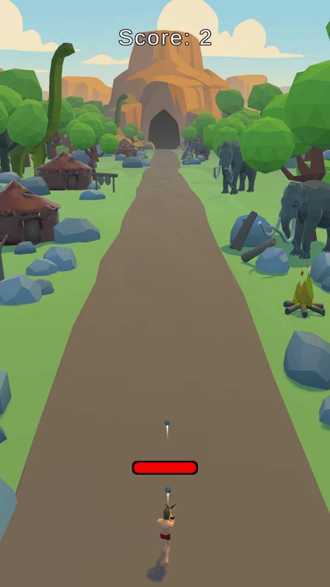
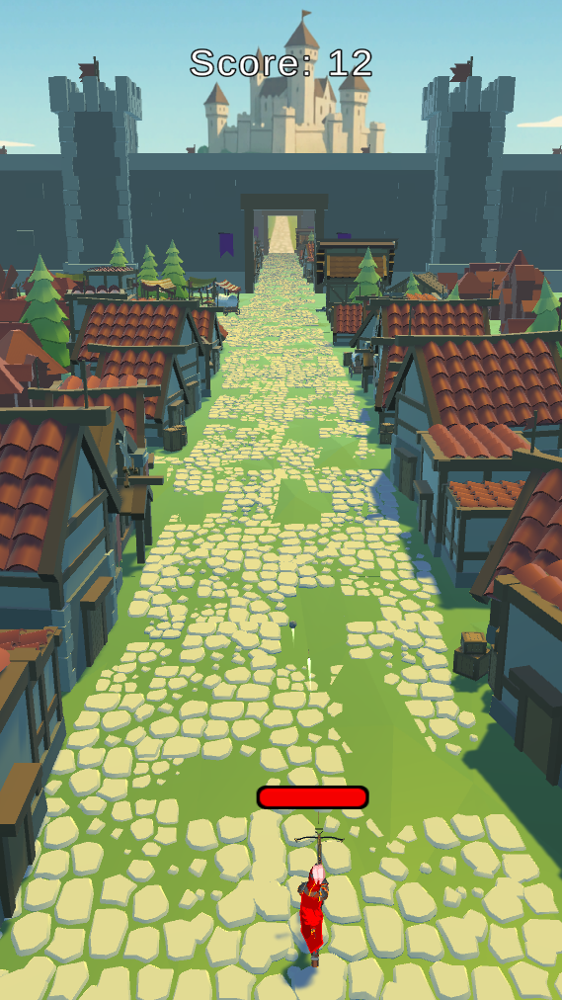
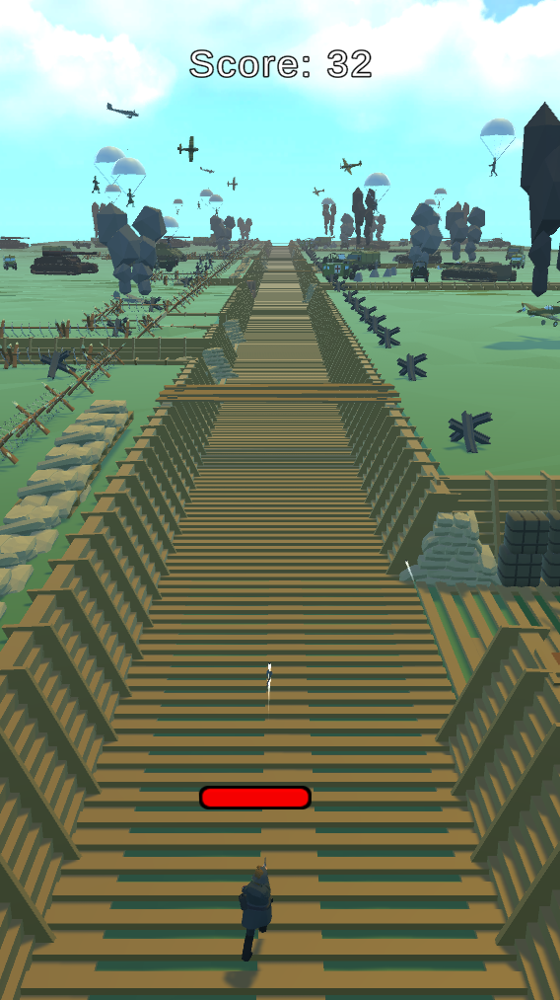
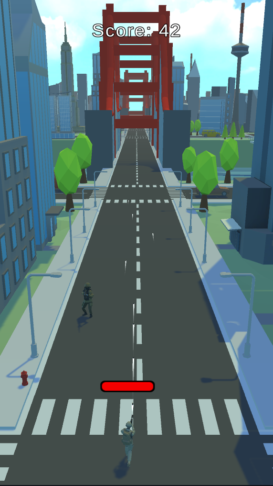
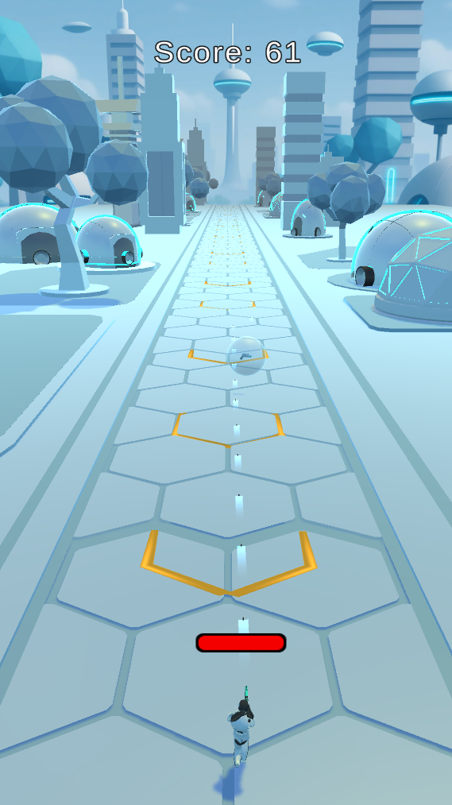

# Timeline Raider — Forward-Scrolling Shooter (Mobile & PC)

**Status:** In development (active) • **Engine:** Unity (C#) • **Platforms:** PC (mouse), Mobile-ready  
**Key tech:** ScriptableObjects, Object Pooling, event-driven state flow, low-poly assets, Blender/Mixamo

Timeline Raider is a forward-scrolling shooter where the world advances through distinct **eras**  
(**Caveman → Medieval → Industrial → WW2 → Modern → Futuristic → Cyberpunk**).  
Each era brings its own environments, enemies, allies, outfits, weapons, and balancing.

  
  
  
  
  

---

## ✨ Features
- **Era-based progression:** Unique environments, enemies, allies, weapons, and HP/damage curves per era.
- **ScriptableObject weapon system:** Centralized stats (damage, fire rate, projectile type, splash radius/damage, visuals).
- **Mobile performance:** Low-poly assets + **Object Pooling** for bullets, enemies, allies, VFX, pickups, and road chunks.
- **Event-driven scene/state flow:** Win/Lose/Pause, pickup/unlock logic, ally management.
- **Content pipeline:** Blender (low-poly + edits), Mixamo (unified rig & shared animations), Unity Particle System for VFX.

---

## 🧱 Architecture (high level)
- `ScriptableObjects/WeaponData` – weapon stats + projectile references  
- `ObjectPoolManager` – pooled spawning/despawning 
- `RoadScroller` – forward world movement via recycled chunks  
- `EraManager` – era management
- `SpawnManager` – enemies/walls/pickups/bosses/allies orchestration  
- `AutoShooter` – player & ally auto-firing  

---

## 📦 Tech Stack
- **Unity (C#)** — gameplay, systems, UI Toolkit/TMP  
- **Blender** — low-poly modeling and edits  
- **Mixamo** — shared armature & cross-compatible animations  
- **Git** — version control  

---

## 🚧 Work in Progress

This project is actively evolving.

Timeline Raider is still a work-in-progress. Development continues as part of a larger personal initiative to build scalable, production-ready games with Unity.

---

## 🧑‍💻 About the Developer

This project was developed by **Onur Özkan** to showcase:
- Unity gameplay programming skills
- Clean and scalable code architecture
- A passion for building engaging, thoughtful game systems

---

## ⚠️ Licensing & Use

This project is shared **for demonstration purposes only** as part of a personal portfolio.

All rights reserved © Onur Özkan.

Please do not copy, reproduce, or reuse any part of this code or assets without explicit permission.

---

## 📬 Contact Me

📧 onurozkanapp@gmail.com  
📍 Istanbul, Turkey/Toronto, ON  
🔗 [LinkedIn](https://www.linkedin.com/in/onur-ozkan-286812149/) | [GitHub](https://github.com/OnurOzkanApp)

---

## ⭐️ Like this project?

Feel free to ⭐️ star the repo or share it with others. Feedback is always welcome!

---
